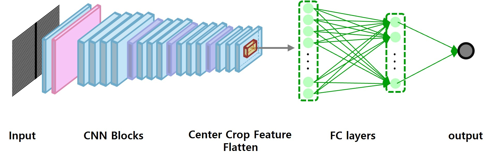
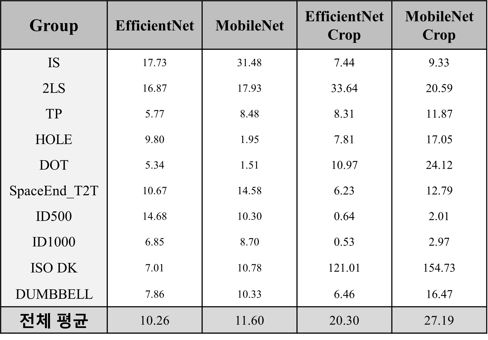

# 삼성전자 반도체 연구소 산학과제 <Deep Learning 기반 MPC 기술 개발>

# Overview

# Descriptions
* 특정 반도체 마스크 패턴 이미지가 입력으로 들어왔을 때, 마스크로 생성한 반도체의 CD값을 예측하는 모델을 개발
* 전처리 과정에서 반복 패턴 구조를 확인하여 center-crop을 Image-level과 feature-level에서 각각 적용하고 결과를 비교함
* 마스크의 패턴이 복잡하지 않으므로, 가벼운 모델(ex. 3-CNN layer model, ResNet18, EfficientNet, MobileNet, etc.. ) 위주로 학습하고 결과를 비교함 

# Experimental Results
* Group은 총 10개 (IS, 2LS, TP, HOLE, DOT, SpacedEnd_T2T, ID500, ID1000, ISO DK, DUMBBELL)로 구성되어 있으며, 각 group 마다의 MSE를 관찰함
